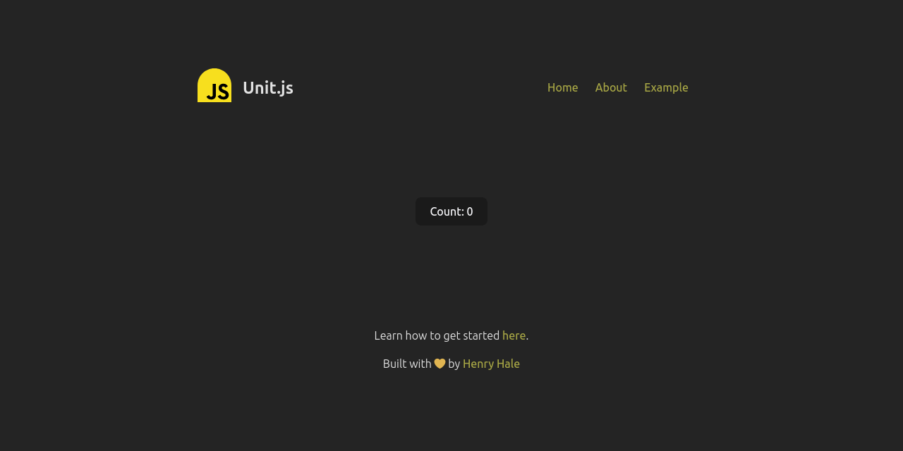

<div align=center>


# unit.js

focus - simplicity - productivity

</div>

## Overview

Unit.js is a lightweight JavaScript UI framework designed to bring focus, simplicity, and enhanced developer productivity to your projects.
Inspired by [Alpine.js](https://alpinejs.dev) and powered by [Vite](https://vitejs.dev), Unit.js encourages a streamlined development experience with a unique approach to components.

Define state and components once, reuse them wherever.

> Note: ⚠️ This project is still under development.

## Key Features

- [x] **Focus on Simplicity**: Unit.js embraces simplicity as a core principle, making it easy for developers to create and manage UI components effortlessly.

- [x] **File-based Components**: Components in Unit.js are represented as files ending with the `.unit` extension. This convention simplifies organization and encourages a modular structure in your project. You can import `.unit` files into another `.unit` file.

- [x] **Alpine.js Syntax**: Leverage the expressive syntax of Alpine.js within your components. Enjoy the power of declarative programming without unnecessary complexity.

- [x] **HTML Build Output**: Generate a fully-rendered page at build time (_Alpine.js will be injected_).

- [x] **Reactive by Default**: Components contain plain HTML code with Alpine.js syntax that is reactive during runtime.

>Note:
>Unit.js is powered by [Vite](https://vitejs.dev) and so most features
>can be used directly in your project for example asset handling.

## Versions

Unit.js maintains it's major releases in branches of this repository:

- `master`: default branch for next version development containing latest features.

- `v1`: _latest_

>Note: Branches named `v#` for example; v1, v2, ... are branches containing specific stable versions of Unit.js

## Preresquites

Basic understanding of HTML, CSS, JavaScript, Alpine.js and Node.js (npm and/or pnpm) is required.

## Getting Started

1. **Installation**: Install Unit.js using your preferred package manager. For a different version, say `v2`, change `v1` to `v2` in the following command.

   Using `npm`:

   ```bash
   npx degit github:henryhale/unit.js/v1 my_app
   cd my_app
   npm install
   ```

   Using `pnpm`:

   ```bash
   pnpm exec degit github:henryhale/unit.js/v1 my_app
   cd my_app
   pnpm install
   ```

2. **Create Your First Component**: Within your `src/pages/` folder, simply create a new file with the `.unit` extension, import it into the `src/pages/index.unit` and you're ready to start building your UI component using [Alpine.js](https://alpinejs.dev/).

   ```html
   <!-- hello.unit -->
   <div x-data="{ message: 'Hello, Unit.js!' }">
     <p x-text="message"></p>
   </div>
   ```

   ```html
   <!-- index.unit -->
   import Hello from "hello.unit";

   <Hello />
   ```

> Note: Feel free to scrap out stuff that you don't need for example .github/workflow/...

3. **Run the Development Server**: Start the development server to see your changes in real-time.

   ```bash
   npm run dev
   # pnpm dev
   ```

4. **Build for Production**: When you're ready to deploy your application, build for production to optimize and minimize your code.

   ```bash
   npm run build
   # pnpm build
   ```

5. **Deployment**: After building your project, production files exist in the `dist` folder at the root of your project.

## File Structure

- `.vscode/`: contains settings and recommended extensions for [Visual Studio Code](https://code.visualstudio.com/) users
- `src/`: all your project source files here
- `src/components/`: contains reusable .unit files
- `src/data/`: contains composable and state scripts
- `src/pages/`: contains only .unit files for corresponding html pages
- `src/public/`: contains assets to be served at the root like _favicon.png_
- `src/template.html`: used to generate html pages from every .unit file in `src/pages/` folder on build time
- `src/main.js`: common script for all pages place in the `src/template.html`. For a different script per page, create another script and add a script tag in the corresponding .unit file under the `src/pages/` folder
- `src/style.css`: Shared CSS styles

## Screenshot



## Contributing

Contributions are welcome to make Unit.js even better! Feel free to open issues or submit pull requests.

## License

Unit.js is released under the [MIT License](./LICENSE.txt).

Copyright &copy; 2023 [Henry Hale](https://github.com/henryhale)

---

_Enjoy the focus, simplicity, and increased productivity that Unit.js brings to your UI development!_
